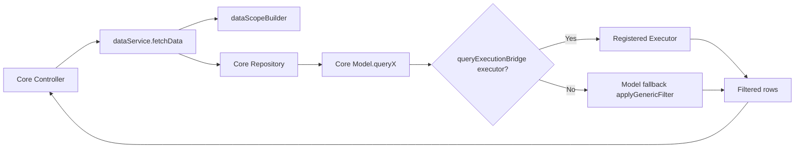
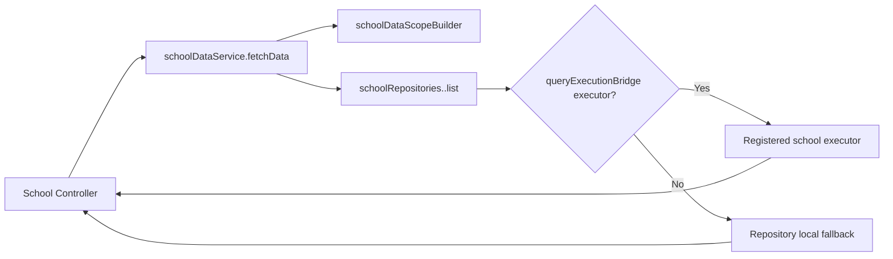
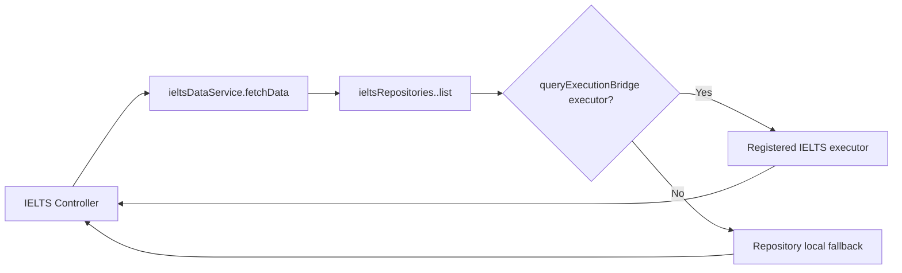
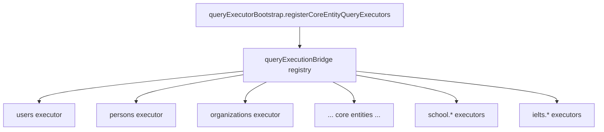
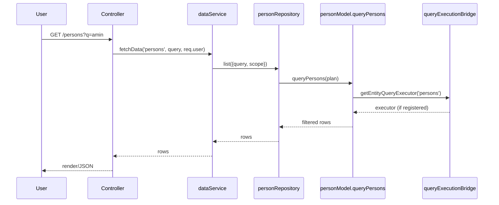

# Data Flow Architecture (Core, School, IELTS)

This page summarizes the current architecture after the service/repository/query-bridge refactor.

## 1) Core Path

### Core module list (exact `FETCH_ENTITY_REGISTRY`)
- `users` -> `userRepository` -> scope: `canViewAll`
- `persons` -> `personRepository` -> scope: `buildPersonScope`
- `organizations` -> `organizationRepository` -> scope: `buildOrganizationScope`
- `contracts` -> `contractRepository` -> scope: `canViewAll`
- `sections` -> `sectionRepository` -> scope: `buildSectionScope`
- `operations` -> `operationRepository` -> scope: `canViewAll`
- `scopes` -> `scopeRepository` -> scope: `canViewAll`
- `accesses` -> `accessRepository` -> scope: `buildAccessScope`
- `accessPolicies` -> `accessPolicyRepository` -> scope: `buildAccessPolicyScope`
- `logs` -> `logRepository` -> scope: `canViewAll`
- `tableSettings` -> `tableSettingsRepository` -> scope: `buildTableSettingsScope`
- `actionStates` -> `actionStateRepository` -> scope: `canViewAll`
- `orgPolicies` -> `orgPolicyRepository` -> scope: `buildOrgPolicyScope`
- `symbols` -> `symbolRepository` -> scope: `buildSymbolScope`
- `sessions` -> `sessionRepository` -> scope: `buildSessionScope`
- `news` -> `newsRepository` -> scope: `buildNewsScope`
- `contactMessages` -> `contactRepository` -> scope: `buildContactScope`
- `newsletter` -> `newsletterRepository` -> scope: `buildNewsletterScope`
- `newsletterSubscribers` -> alias of `newsletter`
- `newsletterSubscriptions` -> alias of `newsletter`
- `subscriptionGroups` -> `subscriptionGroupRepository` -> scope: `buildSubscriptionGroupScope`

Primary files:
- `MVC/services/dataService.js`
- `MVC/services/security/dataScopeBuilder.js`
- `MVC/repositories/*.js`

## 2) School Path

### School module list (exact `SCHOOL_ENTITY_REGISTRY`)
- `students`
- `programs`
- `transactionDefinitions`
- `feeDefinitions` (alias -> `transactionDefinitions`)
- `transactionTemplates` (alias -> `transactionDefinitions`)
- `schoolAccounts`
- `globalTransactions`
- `transactionJournals`
- `academicLedger`
- `academicSnapshots`
- `reportTemplates`
- `reportAssignments`
- `reportInstances`
- `subjects`
- `classes`
- `holidays`
- `terms`
- `departments`
- `teachers`
- `staff`
- `payRates`
- `timesheetPeriods`
- `timesheets`
- `studentProgramRegistrations`
- `studentTermRegistrations`

Primary files:
- `MVC/services/school/schoolDataService.js`
- `MVC/services/school/schoolDataScopeBuilder.js`
- `MVC/repositories/school/index.js`

## 3) IELTS Path

### IELTS module list (exact `IELTS_ENTITY_REGISTRY`)
- `task2Samples` -> `ieltsRepositories.task2Samples`
- `microAssessments` -> `ieltsRepositories.microAssessments`
- `prompts` -> `ieltsRepositories.prompts`
- `scoringHistory` -> `ieltsRepositories.scoringHistory`

Primary files:
- `MVC/services/ielts/ieltsDataService.js`
- `MVC/repositories/ielts/index.js`

## Shared Query Bridge Layer

Primary files:
- `MVC/models/queryExecutionBridge.js`
- `MVC/models/queryExecutorBootstrap.js`
- `app.js` (calls `registerCoreEntityQueryExecutors()`)

## End-to-end example (Core: persons list)

## Quick orientation rule
- Core controllers should prefer `dataService`.
- School controllers should prefer `schoolDataService`.
- IELTS controllers should prefer `ieltsDataService`.
- Direct model calls in controllers are legacy or intentionally specialized paths.
