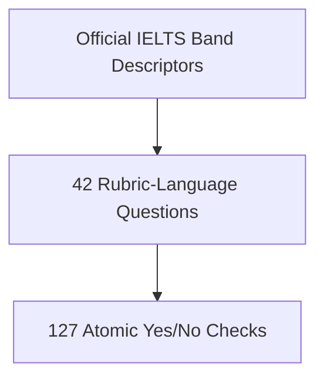

# IELTS Micro-Assessment: Plain-Language FAQ

**Committee companion document**  
**Date:** 2026-09-06  
**Subject:** Why the question bank has 127 items, how weights and prompts work, and how the AI is used  
**Audience:** Dissertation committee and other readers who are not software developers  
**Author:** Researcher (EdD dissertation)

---

## 1. Introduction

This document answers six practical questions about the IELTS Writing Task 2 micro-assessment system in **everyday language**. It is a companion to the technical Committee Reference document, which covers question origins, evolution, and scoring traces in more detail.

**In one sentence:** The system breaks the official IELTS rubric into 127 small yes/no questions, asks the AI to map the essay first (evidence), then answer those questions in small batches, and finally combines the answers using researcher-set weights to produce band scores and feedback.

### Glossary (used throughout)

| Abbreviation | Full name | What it measures |
| --- | --- | --- |
| **TR** | Task Response | Whether the essay answers the question, states a clear position, and develops ideas |
| **CC** | Coherence and Cohesion | How well paragraphs and sentences are organised and linked |
| **LR** | Lexical Resource | Range and accuracy of vocabulary |
| **GRA** | Grammatical Range and Accuracy | Variety and correctness of grammar and punctuation |

---

## 2. How did we arrive at 127 questions—and not more or less?

### Short answer

**127 is the total after breaking the official rubric into the smallest useful yes/no checks.** It was not chosen as a round target (like 100 or 150). It is simply the count that emerged when every band level (1–9) for all four criteria was fully decomposed.

### How the count grew over time

The question bank did not jump straight to 127. It developed in three stages:

| Stage | Approximate count | What changed |
| --- | --- | --- |
| **Stage 1** | ~40 questions | Early questions measured visible essay features (length, paragraph count, presence of a conclusion, etc.) |
| **Stage 2** | ~42 questions | Questions were rewritten in official rubric language (e.g. “Is the position clear throughout?”) |
| **Stage 3 (current)** | **127 questions** | Each rubric idea at each band was split into one atomic check per question |



### Why not fewer questions?

A single sentence in the official band descriptors often contains **several separate ideas**. For example, Band 7 Task Response says the writer should address all parts of the task, present a clear position, and extend and support main ideas. If we combined all of that into one question:

- The AI would give vague answers (“partly yes”).
- It would be hard to explain to a student *which* part failed.
- The same essay could get different scores on repeat runs.

Splitting into atomic questions makes each answer **clear, traceable, and stable**.

### Why not more questions?

Each question must meet three rules:

1. **One idea only** — no double-barrelled questions.
2. **Independently scorable** — answering it should not depend on another question’s answer.
3. **Tied to the rubric** — it must map to something examiners actually look for.

Going further would create **overlap** (two questions measuring the same thing) or questions too fine-grained to answer reliably (e.g. “Is this one word informal?”). The researcher stopped when every rubric claim had a clear atomic check and no redundant items remained.

### The final count

**127 = 43 (TR) + 33 (CC) + 25 (LR) + 26 (GRA)**

This is the sum after decomposition was complete and reviewed—not a number rounded for convenience.

---

## 3. How many questions are in each criterion—and why?

### Overview

| Criterion | Number of questions | Why this many |
| --- | --- | --- |
| **Task Response (TR)** | **43** | The richest rubric: task coverage, position, idea development, conclusion, relevance, off-topic content, and balance across essay parts |
| **Coherence and Cohesion (CC)** | **33** | Paragraphing, logical progression, and linking—but fewer separable facets than TR |
| **Lexical Resource (LR)** | **25** | Vocabulary quality is often described holistically at each band; fewer distinct atomic checks |
| **Grammatical Range and Accuracy (GRA)** | **26** | Similar to LR—error patterns and sentence variety, with less paragraph-level splitting |

Task Response has the most questions because the IELTS Task 2 rubric asks examiners to judge **many different things** about what the essay says and how fully it answers the prompt. Vocabulary and grammar rubrics focus more on **overall quality patterns**, which need fewer separate questions.

### Questions per band level (why middle bands have more)

Official descriptors at **middle bands (4–6)** list many separate weaknesses or partial strengths. Very low bands (1–2) and very high bands (8–9) use shorter, more global language, so they need fewer atomic checks.

**Task Response (43 total)**

| Band | Questions | Plain-language reason |
| --- | --- | --- |
| 1 | 1 | Band 1 is a single global failure (unrelated to task) |
| 2 | 4 | Few ideas, no position, minimal development |
| 3 | 5 | Inadequate task coverage, unclear position, weak paragraphs |
| 4 | 6 | Tangential response, unclear position, repetitive or unsupported ideas |
| 5 | 8 | **Peak** — partial task response, weak conclusion, limited ideas, irrelevant detail |
| 6 | 7 | Addresses all parts but unevenly; some underdeveloped ideas |
| 7 | 5 | Clear position and extended ideas, with some overgeneralisation |
| 8 | 3 | Well-developed, relevant ideas with strong support |
| 9 | 4 | Fully developed position with consistent, relevant support |

**Coherence and Cohesion (33 total)** — peaks at Band 5 (8 questions): weak paragraphing, unclear progression, and overuse or misuse of linking at that level.

**Lexical Resource (25 total)** — peaks at Bands 4–5 (5 and 4 questions): limited range and frequent errors dominate those descriptors.

**Grammatical Range and Accuracy (26 total)** — peaks at Bands 4–5 (5 and 6 questions): simple structures and frequent errors are spelled out in detail at those levels.

### Two prompt families (not the same as batch size)

All 127 questions belong to one of two **prompt families**, based on what kind of judgment they need:

| Prompt family | Questions covered | Why grouped this way |
| --- | --- | --- |
| **Family A** | 76 questions (TR + CC) | Judgments about task, ideas, structure, and flow |
| **Family B** | 51 questions (LR + GRA) | Judgments about word choice, collocation, grammar, and errors |

This split helps the AI focus on the right kind of evidence when answering—not because TR and CC are “more important,” but because they require different reading strategies.

---

## 4. How were weights decided—and why do some questions count more?

### Short answer

**Weights reflect researcher judgment about how important each question is within its band level.** They were not learned by the AI and not chosen at random. Higher weight means: *if this check fails, the essay is less likely to deserve that band for this criterion.*

### The three weight levels

| Weight | Label | Meaning in plain language | How many questions |
| --- | --- | --- | --- |
| **3** | Critical indicator | Core rubric claim for that band—failure here strongly suggests the band is not met | 64 |
| **2** | Important supporting sign | Meaningfully supports the band judgment but is not alone decisive | 45 |
| **1** | Supplementary check | Useful context or edge-case signal; less decisive on its own | 18 |

### How weights were assigned (the logic)

For each band level in each criterion, the researcher:

1. **Read the official descriptor** for that band.
2. **Identified the core claim** — the main thing that defines that band (assigned weight 3).
3. **Marked supporting checks** that nuance or confirm the core claim (weight 2).
4. **Marked minor or edge-case checks** — helpful but not central (weight 1).

This mirrors how human examiners think: some rubric features are **primary** (e.g. “Does the response address all parts of the task?” at Band 6) and others are **secondary** (e.g. “Is there irrelevant detail?” at the same band). The primary check carries more weight.

### Example (illustrative)

At Band 6 Task Response:

| Question (simplified) | Weight | Reason |
| --- | --- | --- |
| Does the response address all parts of the task at least once? | 3 | Core Band 6 requirement |
| Is the position relevant to the question? | 3 | Position is central to Task Response |
| Is at least one main idea inadequately developed? | 2 | Important but partial failure may still allow Band 6 |
| Is the conclusion repetitive? | 1 | Supplementary signal about weak closure |

### How weights are used in scoring

Within each band level, the system checks whether **enough weighted questions pass**. The pass threshold is **50% of the total weight** for that band gate. Failing several weight-3 questions pulls the result down more than failing several weight-1 questions. This produces band scores that align more closely with how examiners weigh primary versus secondary rubric features.

---

## 5. How many questions go into each AI prompt—and was it trial and error?

### Short answer

The AI answers questions in **small batches of about five**, grouped by criterion. This size was found through **guided calibration**—testing the same essays repeatedly and comparing results to human examiner scores—not blind guessing.

### The two-stage flow


Step 3 runs **once** per essay. Step 4 runs **many times** (one batch at a time) until all relevant questions are answered.

### Why not ask all 127 questions in one prompt?

Early versions tried large single prompts. Problems observed:

- The AI **lost focus** halfway through.
- Answers **contradicted** each other (e.g. “position is clear” and “no position expressed”).
- The **same essay scored differently** on repeat runs.

Batching forces the AI to concentrate on a small, related set of questions.

### Why about five questions per batch?

| Batch size tried | What happened |
| --- | --- |
| **Too many (e.g. 20+)** | Unstable answers; scores fluctuated on re-runs |
| **Too few (e.g. 1)** | Very stable, but slow, costly, and lost useful context from related questions |
| **About 5** | Best balance: stable enough for repeatability, efficient enough for practical use |

The final choice of ~5 was documented in scoring calibration reports (versions V2.0 through V2.3), where the same benchmark essays were scored repeatedly while batch size and instructions were adjusted.

### How batches are organised

1. **One criterion per batch** — Task Response questions are not mixed with Grammar questions in the same call.
2. **Band order** — Lower bands first, then higher bands, for consistency across runs.
3. **Fixed instructions** — Temperature set to zero (no randomness), strict answer format, and examples of correct scoring logic for that criterion.

### Was it trial and error?

**Partially—but not random.** The process was:

1. Run the same set of benchmark essays through the system.
2. Compare AI band scores to human examiner scores.
3. Note where answers were unstable or misaligned.
4. Adjust batch size, prompt wording, or evidence requirements.
5. Repeat until stability and alignment improved.

So it was **systematic calibration**, not “try 5 because it felt right.” Five emerged as the practical optimum from that process.

---

## 6. Why do we generate evidence first—and what evidence is produced?

### Short answer

**Evidence answers “where in the essay?” before “does it meet the band?”** This makes scoring more stable, more fair, and easier to explain to students.

### Why generate evidence at all?

| Reason | Explanation |
| --- | --- |
| **Stability** | When the AI must locate specific sentences first, later yes/no answers are more consistent |
| **Transparency** | Students and examiners can see which sentences support each judgment |
| **Fairness** | The AI cannot simply label an essay “good” or “weak” without pointing to proof |
| **Separation of tasks** | Finding information (Step 3) is a different mental task from judging quality (Step 4); mixing them caused errors |

Early direct scoring (essay in → band score out) produced **fluctuating results**. Splitting the work into evidence first, then judgment, was the main design fix.

### What evidence is generated (Step 3)

Step 3 produces a structured **map of the essay**. It does **not** assign band scores.

| Evidence type | What it captures |
| --- | --- |
| **Position / stance** | Does the writer agree, disagree, take a balanced view, or stay unclear? Which sentence states the position? |
| **Contradictions** | Any sentences that conflict with the main position |
| **Topic sentences** | Which sentence in each paragraph introduces the main idea |
| **Body support** | For each body paragraph: is there explanation? an example? which sentences provide support? |
| **Task sub-parts** | Which sentences address each part of the essay question |
| **Vocabulary signals** | Overall range, precision, and error impact (descriptive labels, not a band score) |
| **Grammar signals** | Sentence variety, error frequency, and impact on clarity (descriptive labels, not a band score) |

Think of Step 3 as an examiner **highlighting the essay** before deciding bands. Step 4 then uses those highlights plus the full text to answer the 127 micro-questions.

---

## 7. How are the essay, evidence, and questions fed to the AI?

The AI receives **two different kinds of prompts** in sequence. Below is a **full fictional example** using a short invented essay so readers can see exactly what the system sends and what it expects back.

---

### Fictional setup

**Essay question:**  
*Some people believe that university education should be free for all students. To what extent do you agree or disagree?*

**Student essay (numbered sentences):**

| Index | Sentence |
| --- | --- |
| P0 S0 | I strongly agree that university should be free for everyone. |
| P0 S1 | Education helps society and reduces poverty. |
| P1 S2 | When students pay high fees, many talented people cannot attend. |
| P1 S3 | For example, my cousin wanted to study medicine but could not afford it. |
| P2 S4 | In conclusion, free university is necessary for a fair society. |

**Calculated metrics (from an earlier step):**  
Word count: 52 | Paragraphs: 3 | Sentences: 5 | Has introduction: Yes | Has conclusion: Yes

---

### Prompt A — Step 3: Evidence extraction (full sample)

```
You are an IELTS Writing Task 2 examiner assistant.

Goal: EXTRACT evidence ONLY (sentence numbers). Do NOT score bands and do NOT rewrite the essay.

ESSAY QUESTION:
Some people believe that university education should be free for all students.
To what extent do you agree or disagree?

PARAGRAPH ROLES:
- Paragraph 0: Introduction
- Paragraph 1: Body
- Paragraph 2: Conclusion

ESSAY SENTENCES:
P0 S0: I strongly agree that university should be free for everyone.
P0 S1: Education helps society and reduces poverty.
P1 S2: When students pay high fees, many talented people cannot attend.
P1 S3: For example, my cousin wanted to study medicine but could not afford it.
P2 S4: In conclusion, free university is necessary for a fair society.

STANCE RULES:
- "agree": writer clearly supports one side
- "disagree": writer clearly rejects one side
- "partial": writer explicitly supports a balanced position
- "unclear": no clear position

Return JSON only with:
- position (stance, stance sentence index, contradiction sentence indices)
- topic sentence for each paragraph
- body support (explanation and/or example per body paragraph)
- vocabulary and grammar signal labels (range, precision, error frequency)

Rules:
1. Return JSON only — no commentary.
2. All sentence indices must be 0 to 4.
3. Be conservative: if unsure, use "unclear" and empty lists.
```

### Example Step 3 response (what the AI returns)

```json
{
  "position": {
    "stance": "agree",
    "stanceSentenceIndex": 0,
    "contradictionSentenceIndices": []
  },
  "topicSentenceByParagraph": [
    { "paragraphIndex": 0, "topicSentenceIndex": 0 },
    { "paragraphIndex": 1, "topicSentenceIndex": 2 },
    { "paragraphIndex": 2, "topicSentenceIndex": 4 }
  ],
  "bodySupport": [
    {
      "paragraphIndex": 1,
      "hasExplanation": true,
      "hasExample": true,
      "evidenceSentenceIndices": [2, 3]
    }
  ],
  "lexicalQuality": {
    "range": "adequate",
    "precision": "mixed",
    "uncommonSkill": "none"
  },
  "errorProfiles": {
    "grammar": "rare",
    "lexical": "rare",
    "punctuation": "rare"
  }
}
```

This evidence map is saved and passed forward. **No band score appears here.**

---

### Prompt B — Step 4: Micro-question grading (full sample, one batch)

Below is one batch of **three** Task Response questions (a real batch would have about five; three are shown here for readability).

```
You are a Senior IELTS Examiner.

You MUST return ONLY raw JSON (no commentary).

ESSAY QUESTION:
Some people believe that university education should be free for all students.
To what extent do you agree or disagree?

STANCE: agree

CALCULATED METRICS:
Word count: 52 | Paragraphs: 3 | Sentences: 5
Introduction present: Yes | Conclusion present: Yes

LANGUAGE EVIDENCE SNAPSHOT (from Step 3):
- Stance: agree (sentence 0)
- Topic sentences: P0=S0, P1=S2, P2=S4
- Body paragraph 1: has explanation (S2), has example (S3)
- Lexical range: adequate | Precision: mixed | Grammar errors: rare

ESSAY CONTENT:
P0 S0: I strongly agree that university should be free for everyone.
P0 S1: Education helps society and reduces poverty.
P1 S2: When students pay high fees, many talented people cannot attend.
P1 S3: For example, my cousin wanted to study medicine but could not afford it.
P2 S4: In conclusion, free university is necessary for a fair society.

SCORING LOGIC (examples for Task Response):
- Answer "Yes" only when the feature is clearly present with direct evidence.
- Answer "No" when the feature is absent or only weakly implied.
- Cite sentence numbers in "evidence" for every answer.

QUESTIONS:

ID: TR5-3
Scope: whole essay
Allowed values: Yes / No
Question: Is a position or opinion expressed?
Band criteria: "A position is presented but development is not always clear."

ID: TR5-5
Scope: whole essay
Allowed values: Yes / No
Question: Is there no conclusion drawn?
Band criteria: "There may be no conclusion drawn."

ID: TR5-7
Scope: whole essay
Allowed values: Yes / No
Question: Are main ideas not sufficiently developed?
Band criteria: "Main ideas are limited and not sufficiently developed."

OUTPUT FORMAT:
{
  "TR5-3": { "value": "Yes", "evidence": [0] },
  "TR5-5": { "value": "No", "evidence": [4] },
  "TR5-7": { "value": "Yes", "evidence": [1, 2] }
}
```

### Example Step 4 response (what the AI returns)

```json
{
  "TR5-3": { "value": "Yes", "evidence": [0] },
  "TR5-5": { "value": "No", "evidence": [4] },
  "TR5-7": { "value": "Yes", "evidence": [1, 2] }
}
```

**How to read this batch:**

- **TR5-3 = Yes:** A clear position is expressed (sentence 0: “I strongly agree…”).
- **TR5-5 = No:** A conclusion exists (sentence 4), so “no conclusion” is false.
- **TR5-7 = Yes:** Main ideas are thin—sentence 1 is general and sentence 2 is brief; development is limited.

These answers feed into the **band gate** logic: for each band level, the system checks whether enough weighted questions pass. After all batches complete, the highest band where enough checks pass becomes the criterion score. Step 5 then turns pass/fail results into student-facing feedback with sentence references.

---

## 8. Quick reference summary

| Question | Short answer |
| --- | --- |
| **Why 127 questions?** | Natural total after splitting every official rubric idea at every band into one atomic yes/no check—not a round target number. |
| **Questions per criterion?** | TR 43, CC 33, LR 25, GRA 26. TR has the most because the task rubric has the most separable facets; middle bands (4–6) have the most questions per band. |
| **How were weights decided?** | Researcher judgment: 3 = critical rubric claim, 2 = important support, 1 = supplementary. Compares importance of each answer within a band gate—not AI-learned. |
| **Questions per prompt?** | About five per batch, grouped by criterion. Calibrated systematically (not random trial and error) for stability versus speed. |
| **Why generate evidence?** | Separates “where in the essay?” from “does it meet the band?”—improves stability, fairness, and explainability. |
| **What evidence?** | Stance, topic sentences, body support, task sub-parts, vocabulary signals, grammar signals—no band scores in this step. |
| **How is everything fed to the AI?** | Step 3 prompt: essay + structure → evidence map. Step 4 prompts: essay + metrics + evidence + batch of questions → yes/no answers with sentence proof. |

---

**Companion document:** For question lineage (40 → 42 → 127), prototype history, scoring audit examples, and technical storage details, see *IELTS Micro-Assessment Committee Reference* (2026-09-06).
